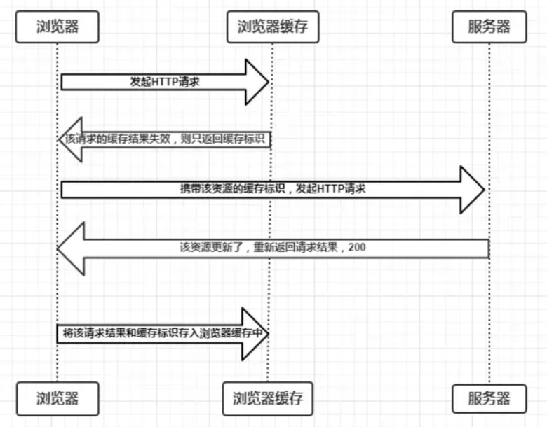

# 🤡 浏览器缓存

## 强制缓存

### Expires

HTTP1.0时期的产物，是HTTP`响应头`中的字段。其规定`缓存的过期时间`。 Expires的控制原理是`使用客户端的时间和服务器端返回的时间进行对比`，如果客户端时间和服务器端时间时区不同，则会出现缓存失效。

### Cache-Control

HTTP1.1后，Cathe-Control取代了Expires。是HTTP`响应头`中的字段。主要的取值为：

* `public`: 所有内容都将被缓存，客户端和代理服务器都可以缓存
* `private`: 所有内容都将被缓存，但只有客户端可以缓存 **默认值**
* `no-cache`: 客户端缓存内容，但是否使用缓存需要经过协商缓存来验证决定。
* `no-store`：所有内容都不会被缓存。
* `max-age=xxx`：缓存内容将在xxx秒后失效。

同时要注意，Cache-Control的优先级要比Expires高。

Cache又分为：

* from memory cache：内存缓存 内存缓存的特点是其具有快速读取和时效性的特点。 存放在**进程**中
* from disc cache： 硬盘缓存 硬盘缓存则存储在硬盘上。读取时需要对硬盘进行I/O操作，速度慢。

在浏览器中，JS文件和图片等会存储到内存缓存中。 CSS文件会存储到硬盘缓存中。

## 协商缓存

协商缓存就是**强制缓存失效**以后，浏览器带着**缓存标识**(其实就是`Last-Modified`字段)，再次向服务器发起请求。由服务器根据缓存标识决定是否使用缓存的过程。

分为两种情况：

1. 该资源无更新，返回`304`，浏览器继续从缓存中取。 
2. 该资源更新了，返回`200`和新的结果。浏览器将新的结果存入缓存中。 

### Last-Modified

是HTTP`响应头`的一个字段，描述的是该资源文件在服务器最后被修改的时间。

### If-Modified-since

是HTTP`请求头`的一个字段，描述的是客户端再次对服务器发起请求时，携带的上次服务器返回的`Last-Modified`值。通过此字段告诉服务器该资源上次请求返回的最后被修改的时间。

* 如果服务器存储的最后修改时间**大于**`if-Modified-since`的值，即修改了，返回`200`和`新内容`。
* 如果服务器存储的最后修改时间与`if-Modified-since`的值**一致**，即没有修改，返回`304`.

### E-tag

是HTTP`响应头`中的字段，是服务器生成的当前资源文件的一个唯一标识。

E-tag if-none-match的机制优先级**高于**Last-modifed和if-modified-since

### if-none-match

是HTTP`请求头`中的字段，记录的是上一次访问时候服务器返回的E-tag值。 服务器会将`if-none-match`的值和服务器上存储的`E-tag`值进行对比：

* if-none-match和服务器现在的e-tag**不同**，返回`200`和新的内容
* if-none-match和服务器现在的e-tag**相同**，返回`304`.

## 总结

1. 强制缓存**优先**于协商缓存。
   * 强制缓存生效则直接使用缓存
   * 强制缓存不生效则进行协商缓存
     * Last-modifed和if-modifed-since
     * E-tag和if-none-match
2. 优先级
   * `catch-Control` > `Expires`
   * `e-tag/if-none-match` > `last-modified/if-modified-since`
