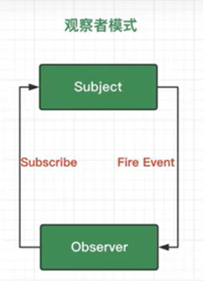
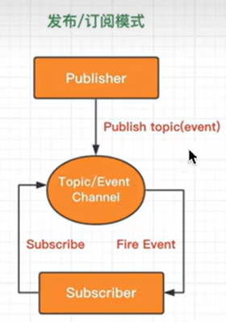

# 观察者模式
观察者`Observer`直接订阅主题`Subject`，当Subject状态改变时候，会触发Observer中的事件。

过程：
    1. 定义Subject
    2. 定义Observer
    3. 将Observer绑定在Subject上
    4. Subject状态改变，通知Observer(调用Observer上的事件)
``` javascript
class Subject {
  constructor() {
    this.state = 0; // 1. 定义Suject
    this.oberservers = [];
  }
  attach(observer) {
    this.oberservers.push(observer); // 3. 将Observer绑定到Subject上
  }
  changeState(state) {
    this.state = state; // 4. 修改Subject状态
    this.oberservers.forEach((item) => {
      item.doSomeThing(this); // 5. 通知Observer
    });
  }
}

class Observer {
  constructor(name) {
    this.name = name; // 2. 定义Obeserver
  }
  doSomeThing(subject) {
    console.log("subject的状态改变了");
    console.log(subject.state); // 6. 获取Subject的状态，并且采取一系列动作
  }
}

let sub = new Subject();
let ob = new Observer("test");
sub.attach(ob);
sub.changeState(1); // 输出1

```

# 发布订阅者模式
订阅者(Subscriber)把自己想订阅的事件注册到调度中心(Topic)，当发布者(Publisher)发布该事件到调度中心，也就是该事件触发后，由调度中心统一调度订阅者注册到调度中心的处理代码。

``` javascript
let event_channel = {
  subscribers: [],
  on(method) {
    // 订阅
    this.subscribers.push(method); // 把每一个订阅者的方法存起来
  },
  emit(message) {
    // 发布
    this.subscribers.forEach((item) => {
      item(message);
    });
  },
};
event_channel.on((value) => {
  console.log("first-one get" + value); // 订阅时绑定的是一个个方法
});
event_channel.on((value) => {
  console.log("second-one also get" + value);
});
event_channel.emit("300"); // 发布一个值
```